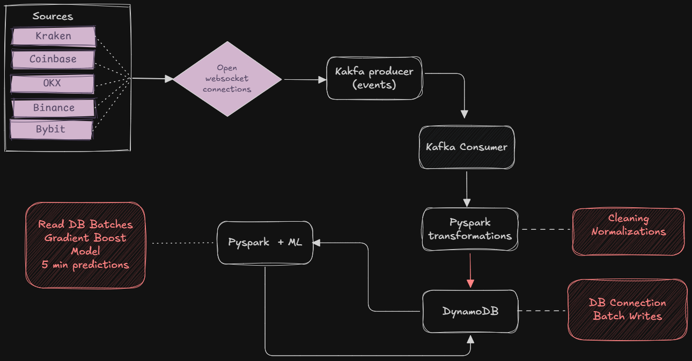

### Project Description
A real-time crypto market intelligence pipeline for __crypto-traders__, __market data teams__, __quant researchers__ to keep track of fast-moving digital asset markets. It captures liquidation events and trade activity across major crypto exchanges.

### The problem it solves
- Each exchange publishes its own feed.
- Liquidation events often happen across multiple venues at different times.
- Traders and analysts need to spot risk, momentum shifts, and possible arbitrage opportunities before the market moves too far.
- Without a unified, time-synced feed, you are forced to watch dozens of disconnected streams manually.

This project solves that by creating a centralized pipeline that:

- connects to multiple exchanges,
- ingests live trade and liquidation messages,
- standardizes the data,
- sends it through a streaming pipeline,
- stores it for later querying and analysis,
and optionally uses machine learning to detect patterns or predict outcomes.

### Who this is built for
This is especiall useful for:
- crypto traders looking for liquidation signals or sudden market stress
- quants who want to model market behavior from live exchange data
- data engineers building event-driven analytics pipelines
- researchers testing market prediction or anomaly-detection model
- teams that need a real-time data backbone for dashboards or alerts.

### Application Architecture


To setup the application run
```sh
docker compose up
```
Access the dashboard at:
`http://localhost:8080` and click connect

The api is available at:
`http://localhost:8080/docs`

##### View Kafka event streams

In a new shell tab start the kafka shell

```sh
docker exec --workdir /opt/kafka/bin -it exchange_broker sh
```

Read events sent to the consumer
```sh
./kafka-console-consumer.sh --bootstrap-server localhost:9092 --topic crypto_exchange_trades --from-beginning

```